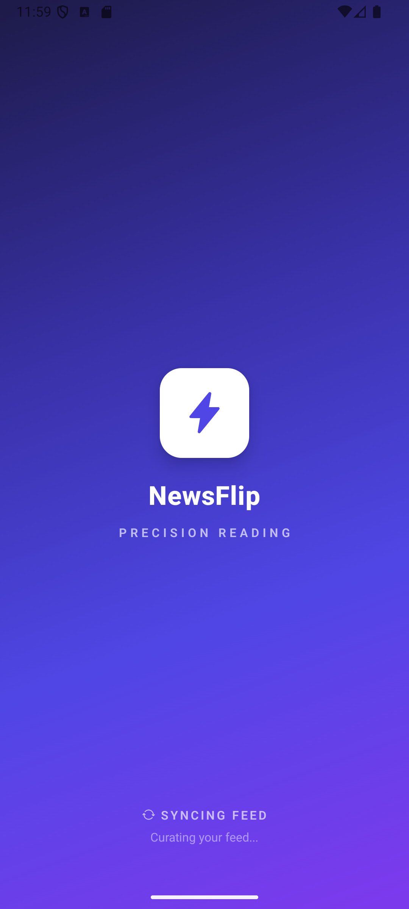

# NewsFlip 📰

A modern, cross-platform news reader app built with React Native and Expo. NewsFlip delivers a beautiful reading experience with infinite scroll, dark/light mode, offline caching, and responsive layouts for all devices.

<div align="center">
  
</div>

## ✨ Features

### Core Features
- **📱 News Feed** - Browse top headlines with infinite scroll pagination
- **🔍 Smart Search** - Search articles with 400ms debouncing and filter results
- **📖 Article Detail** - Full article view with hero images and "Read Full Article" button
- **🏷️ Category Filters** - Filter by General, Technology, Sports, Business, Health
- **🌓 Dark/Light Mode** - Automatic system theme detection with manual toggle
- **📱 Responsive Design** - Adaptive layouts for phones and tablets in all orientations
- **💾 Offline Caching** - Read previously loaded articles without internet
- **♿ Accessibility** - Dynamic font scaling support for better readability

### Bonus Features
- **🔖 Bookmarks** - Save articles for later reading
- **🔄 Pull-to-Refresh** - Refresh content with a simple gesture
- **⚡ Skeleton Loaders** - Beautiful loading states (not just spinners)
- **🎨 Modern UI** - Clean, professional design with smooth animations
- **📊 Error Handling** - Graceful error states with retry functionality

## 📱 Responsive Layouts

| Device | Portrait | Landscape |
|--------|----------|-----------|
| **Phone** | 1-column list | 2-column grid |
| **Tablet** | 2-column grid | 3-column grid |

Layouts update instantly on device rotation using `useWindowDimensions` hook.

## 🚀 Getting Started

### Prerequisites
- Node.js 18+ and npm/yarn
- Expo CLI (`npm install -g expo-cli`)
- For Android: Android Studio or physical device
- For iOS: Xcode (macOS only) or physical device

### Installation

1. **Clone the repository**
   ```bash
   git clone https://github.com/yourusername/NewsFlip.git
   cd NewsFlip
   ```

2. **Install dependencies**
   ```bash
   npm install
   ```

3. **Start the development server**
   ```bash
   npx expo start
   ```

4. **Run on your device**
   - **Android**: Press `a` or scan QR code with Expo Go app
   - **iOS**: Press `i` or scan QR code with Camera app
   - **Web**: Press `w` to open in browser

### Building for Production

#### Android APK
```bash
# Install EAS CLI
npm install -g eas-cli

# Login to Expo
eas login

# Build APK
eas build --platform android --profile preview
```

#### iOS Build
```bash
# Build for iOS (requires macOS)
eas build --platform ios --profile preview
```

## 🏗️ Project Structure

```
NewsFlip/
├── app/                    # Expo Router screens
│   ├── (tabs)/            # Tab navigation
│   │   ├── index.tsx      # Home/News Feed
│   │   ├── search.tsx     # Search screen
│   │   ├── saved.tsx      # Bookmarks
│   │   └── profile.tsx    # User profile
│   └── article/[id].tsx   # Article detail screen
├── components/            # Reusable components
│   └── ui/               # UI components
│       ├── ArticleCard.tsx
│       ├── CategoryChip.tsx
│       └── SkeletonLoader.tsx
├── context/              # React Context providers
│   ├── AppContext.tsx    # App state (theme, bookmarks)
│   └── NewsContext.tsx   # News data & caching
├── services/             # API services
│   └── guardianApi.ts    # News API integration
├── constants/            # Theme & constants
│   └── theme.ts          # Colors, fonts, spacing
└── screenshots/          # App screenshots
```

## 🎨 Tech Stack

- **Framework**: Expo SDK 52+
- **Language**: TypeScript
- **Navigation**: Expo Router (file-based routing)
- **State Management**: React Context API
- **Storage**: AsyncStorage (offline caching)
- **API**: The Guardian Open Platform API
- **UI Components**: Custom components with React Native
- **Icons**: Expo Vector Icons (Ionicons)

## 🔌 API Configuration

The app uses **The Guardian API** for fetching articles.

**API Key**: `dc3a697d-e14b-4df6-8782-d72acfc4c04e` (Developer tier)

To use your own API key:
1. Get a free API key from [The Guardian Open Platform](https://open-platform.theguardian.com/)
2. Update `services/guardianApi.ts`:
   ```typescript
   const GUARDIAN_API_KEY = 'your-api-key-here';
   ```

## 📸 Screenshots

See the `/screenshots` folder for:
- `android_portrait_home.png` - Home screen (portrait)
- `android_landscape_home.png` - Home screen (landscape)
- `android_dark_mode.png` - Dark mode
- `android_article_detail.png` - Article detail
- `android_search.png` - Search screen
- `tablet_portrait.png` - Tablet layout (portrait)
- `tablet_landscape.png` - Tablet layout (landscape)

## ✅ Features Checklist

- ✅ News feed with infinite scroll
- ✅ Skeleton loaders (not spinners)
- ✅ Error states with retry button
- ✅ Article detail screen with hero image
- ✅ "Read Full Article" button
- ✅ Category filters (5 categories)
- ✅ Search with 400ms debouncing
- ✅ Dark/Light mode (auto + manual toggle)
- ✅ Responsive layouts (phone & tablet)
- ✅ Portrait/Landscape support
- ✅ Offline caching (30-minute cache)
- ✅ Pull-to-refresh
- ✅ Dynamic font scaling
- ✅ TypeScript implementation

## 🐛 Known Issues

- API rate limits may occur with heavy usage (cached articles shown as fallback)
- Some news sources may not provide full article text (use "Read Full Article" button)

## 🔧 Troubleshooting

**App won't start:**
```bash
# Clear cache and restart
npx expo start -c
```

**Build errors:**
```bash
# Clean install
rm -rf node_modules package-lock.json
npm install
```

**API errors:**
- Check internet connection
- Verify API key is valid
- Cached articles will be shown if available

## 📝 License

This project is licensed under the MIT License.

## 👨‍💻 Developer

Built as part of the NewsFlip Developer Assignment.

## 🙏 Acknowledgments

- News data provided by [The Guardian Open Platform](https://open-platform.theguardian.com/)
- Icons by [Expo Vector Icons](https://icons.expo.fyi)
- Built with [Expo](https://expo.dev)

---

**Note**: This app was developed using AI assistance (ChatGPT, Copilot) as permitted by the assignment guidelines.
